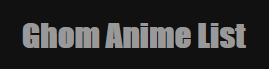

# Ghom Anime List

## Regardez ma propre liste :

## Créez votre propre liste d'anime :

1. Exécutez la commande `git clone https://github.com/CamilleAbella/MyAnimeList.git` dans le dossier de votre choix.
2. Remplacez le contenu du dossier `/animes` par vos animés favoris sous forme d'images appelées par le titre de l'anime qu'elle représente (en plus de l'extension originale de l'image).
3. Exécutez la commande `node .` en vous plaçant à la base de votre projet.
4. Ajustez chaque `/animes/**/meta.json` afin de renseigner les synopsis, tags ou notes de vos animés favoris.